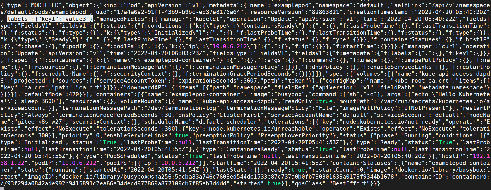

.. contents::
   :depth: 3
..

API Server的基本操作
====================

Kubernetes 中的资源访问类型有两种。

-  一种是由 Pod
   提供的服务资源，它可通过Service或Ingress发布以供外部访问，这种访问不需要经过API
   Server的认证。
-  另一种是对集群内部资源的操作，它需要通过API
   Server访问，而且要经过一定的认证授权才能进行操作。

API Server提供了对Kubernetes中各类资源对象进行增删改查等操作的HTTP
REST接口。对资源执行的任何操作，都需要由API Server 处理。

在之前所有的演示中，我们是通过命令行工具kubectl客户端来访问API
Server的，\ **kubectl客户端将把命令行转换为对API Server的** **REST
API调用。**\ 如果要对Kubernetes的功能进行自定义扩展或二次开发，则需要直接调用API
Server的REST API。

我们先在Master节点上打开kubectl反向代理，通过使kubectl反向代理API
Server，可以直接使用kubectl命令的认证授权来访问API Server。

.. code:: shell

   $ kubectl proxy --port=8080
   Starting to serve on 127.0.0.1:8080

API Server支持的操作非常多，可以通过以下命令获取API的Swagger
Json定义，它对每个API都进行了详细说明。

.. code:: shell

   $ curl http://localhost:8080/openapi/v2

由于API众多，本节并不打算介绍所有的API，每一个API的具体使用方法可以参见官方文档，或访问API
Server的路径/openapi/v2（在
本例中为http://localhost:8080/openapi/v2）来获取Swagger.json格式的详细说明。

1 写操作
--------

1.1 创建资源
~~~~~~~~~~~~

创建资源的API调用方式如下。

::

   HTTP请求
       POST
       /{apiVersion}/namespaces/{namespace}/{资源类型}

创建资源的API的URL参数如表

+---------+------------------------------------------------------------+
| 参数    | 描述                                                       |
+=========+============================================================+
| api     | 与yaml模                                                   |
| Version | 板中填写的apiVersion属性类似，区别在于加了api或apis前缀。  |
|         | 例如，Pod的apiVersion为api/v1，Deployment控制器的apiVer    |
|         | sion为apis/apps/v1，Job控制器的apiVersion为apis/batch/v1等 |
+---------+------------------------------------------------------------+
| na      | 命名空间，如果没有特定命名空间可使用“default”              |
| mespace |                                                            |
+---------+------------------------------------------------------------+
| 资      | 资源类型使用复数形式，例如，pods、deployments、daemons     |
| 源类型  | ets、services、ingresses、configmaps、limitranges、nodes等 |
+---------+------------------------------------------------------------+

创建资源的API的请求体只有一个参数——资源类型Json对象，它表示使用Json方式描述的资源对象，等同于之前介绍的yaml模板，只
是这里用Json表现方式传入。

创建资源的API的返回值

====== ======================== ======================
状态码 返回消息体               描述
====== ======================== ======================
202    创建后的资源类型Json对象 请求已接受（accepted）
200    创建后的资源类型Json对象 请求成功（OK）
201    创建后的资源类型Json对象 请求已创建（created）
====== ======================== ======================

例如，要创建一个Pod对象，执行以下命令。

.. code:: shell

   $ curl http://localhost:8080/api/v1/namespaces/default/pods -H "Content-Type:application/json" -X \
           POST -d '{
           "apiVersion": "v1",
           "kind": "Pod",
           "metadata": {
           "name": "examplepod"
           },
       "spec": {
       "containers": [
           {
           "name": "examplepod-container",
           "image": "busybox",
           "imagePullPolicy": "IfNotPresent",
           "command": ["sh","-c"],
           "args": ["echo \"Hello Kubernetes!\"; sleep 3600"]
           }
         ]
       }
   }'

本例中使用curl命令来执行http请求，请求地址为http://localhost:8080/api/v1/namespaces/default/pods，命名空间为default。-H参数表示增加请求的Header，在本例中为“Content-Type:application/json”；-X参数表示要使用的HttpMethod，在本例中为POST请求；-d参数表示要传入的请求体，在本例中为Pod模板的Json形式，模板字符串包含在一对单引号当中。

若通过$ kubectl get pod命令查看Pod列表，可以看到Pod已成功创建

.. code:: shell

   $ kubectl get pod
   NAME         READY   STATUS    RESTARTS   AGE
   examplepod   1/1     Running   0          <invalid>

其余资源（如控制器、Service、PVC、ConfigMap等）也可以使用这种方式创建。

1.2 替换资源
~~~~~~~~~~~~

替换资源的API调用方式如下。

::

   HTTP请求
       PUT
       /{apiVersion}/namespaces/{namespace}/{资源类型}/{name}

替换资源的API的URL参数如表

+---------+------------------------------------------------------------+
| 参数    | 描述                                                       |
+=========+============================================================+
| api     | 与yaml模                                                   |
| Version | 板中填写的apiVersion属性类似，区别在于加了api或apis前缀。  |
|         | 例如，Pod的apiVersion为api/v1，Deployment控制器的apiVer    |
|         | sion为apis/apps/v1，Job控制器的apiVersion为apis/batch/v1等 |
+---------+------------------------------------------------------------+
| na      | 命名空间，如果没有特定命名空间可使用“default”              |
| mespace |                                                            |
+---------+------------------------------------------------------------+
| 资      | 资源类型使用复数形式，例如，pods、deployments、daemons     |
| 源类型  | ets、services、ingresses、configmaps、limitranges、nodes等 |
+---------+------------------------------------------------------------+
| name    | 资源名称                                                   |
+---------+------------------------------------------------------------+

替换资源的API的请求体只有一个参数——资源类型Json对象，它表示使用Json方式描述的资源对象，等同于之前介绍的yaml模板，只
是这里用Json表现方式传入。

替换资源的API的返回值如表

====== ======================== =====================
状态码 返回消息体               描述
====== ======================== =====================
200    替换后的资源类型Json对象 请求成功（OK）
201    替换后的资源类型Json对象 请求已创建（created）
====== ======================== =====================

我们修改之前示例中定义的Pod，为其增加标签（label），即key1:
value1。可以使用API修改之前创建的Pod，但这种更新相对
死板，需要先通过\ ``$ curl http://localhost:8080/api/v1/namespaces/default/pods/examplepod``\ 获取当前的Pod信息，然后粘贴status属性之前的所有片段以作为请求体的基础，并添加标签信息。

.. code:: shell

   $ curl http://localhost:8080/api/v1/namespaces/default/pods/examplepod -H \
   "Content-Type:application/json" -X PUT -d '{
       "kind": "Pod",
       "apiVersion": "v1",
       "metadata": {
           "name": "examplepod",
           "namespace": "default",
           "selfLink": "/api/v1/namespaces/default/pods/examplepod",
           "uid": "17a4a6e2-91ff-43b9-b9bc-ed37e8176a64",
           "resourceVersion": "82851536",
           "creationTimestamp": "2022-04-20T05:40:20Z",
           "labels": {
               "key1": "value1"
           },
           "managedFields": [
               {
                   "manager": "curl",
                   "operation": "Update",
                   "apiVersion": "v1",
                   "time": "2022-04-20T05:40:20Z",
                   "fieldsType": "FieldsV1",
                   "fieldsV1": {
                       "f:spec": {
                           "f:containers": {
                               "k:{\"name\":\"examplepod-container\"}": {
                                   ".": {},
                                   "f:args": {},
                                   "f:command": {},
                                   "f:image": {},
                                   "f:imagePullPolicy": {},
                                   "f:name": {},
                                   "f:resources": {},
                                   "f:terminationMessagePath": {},
                                   "f:terminationMessagePolicy": {}
                               }
                           },
                           "f:dnsPolicy": {},
                           "f:enableServiceLinks": {},
                           "f:restartPolicy": {},
                           "f:schedulerName": {},
                           "f:securityContext": {},
                           "f:terminationGracePeriodSeconds": {}
                       }
                   }
               },
               {
                   "manager": "kubelet",
                   "operation": "Update",
                   "apiVersion": "v1",
                   "time": "2022-04-20T05:40:22Z",
                   "fieldsType": "FieldsV1",
                   "fieldsV1": {
                       "f:status": {
                           "f:conditions": {
                               "k:{\"type\":\"ContainersReady\"}": {
                                   ".": {},
                                   "f:lastProbeTime": {},
                                   "f:lastTransitionTime": {},
                                   "f:status": {},
                                   "f:type": {}
                               },
                               "k:{\"type\":\"Initialized\"}": {
                                   ".": {},
                                   "f:lastProbeTime": {},
                                   "f:lastTransitionTime": {},
                                   "f:status": {},
                                   "f:type": {}
                               },
                               "k:{\"type\":\"Ready\"}": {
                                   ".": {},
                                   "f:lastProbeTime": {},
                                   "f:lastTransitionTime": {},
                                   "f:status": {},
                                   "f:type": {}
                               }
                           },
                           "f:containerStatuses": {},
                           "f:hostIP": {},
                           "f:phase": {},
                           "f:podIP": {},
                           "f:podIPs": {
                               ".": {},
                               "k:{\"ip\":\"10.0.6.212\"}": {
                                   ".": {},
                                   "f:ip": {}
                               }
                           },
                           "f:startTime": {}
                       }
                   }
               }
           ]
       },
       "spec": {
           "volumes": [
               {
                   "name": "kube-api-access-dzpd6",
                   "projected": {
                       "sources": [
                           {
                               "serviceAccountToken": {
                                   "expirationSeconds": 3607,
                                   "path": "token"
                               }
                           },
                           {
                               "configMap": {
                                   "name": "kube-root-ca.crt",
                                   "items": [
                                       {
                                           "key": "ca.crt",
                                           "path": "ca.crt"
                                       }
                                   ]
                               }
                           },
                           {
                               "downwardAPI": {
                                   "items": [
                                       {
                                           "path": "namespace",
                                           "fieldRef": {
                                               "apiVersion": "v1",
                                               "fieldPath": "metadata.namespace"
                                           }
                                       }
                                   ]
                               }
                           }
                       ],
                       "defaultMode": 420
                   }
               }
           ],
           "containers": [
               {
                   "name": "examplepod-container",
                   "image": "busybox",
                   "command": [
                       "sh",
                       "-c"
                   ],
                   "args": [
                       "echo \"Hello Kubernetes!\"; sleep 3600"
                   ],
                   "resources": {},
                   "volumeMounts": [
                       {
                           "name": "kube-api-access-dzpd6",
                           "readOnly": true,
                           "mountPath": "/var/run/secrets/kubernetes.io/serviceaccount"
                       }
                   ],
                   "terminationMessagePath": "/dev/termination-log",
                   "terminationMessagePolicy": "File",
                   "imagePullPolicy": "IfNotPresent"
               }
           ],
           "restartPolicy": "Always",
           "terminationGracePeriodSeconds": 30,
           "dnsPolicy": "ClusterFirst",
           "serviceAccountName": "default",
           "serviceAccount": "default",
           "nodeName": "gitee-k8s-w27",
           "securityContext": {},
           "schedulerName": "default-scheduler",
           "tolerations": [
               {
                   "key": "node.kubernetes.io/not-ready",
                   "operator": "Exists",
                   "effect": "NoExecute",
                   "tolerationSeconds": 300
               },
               {
                   "key": "node.kubernetes.io/unreachable",
                   "operator": "Exists",
                   "effect": "NoExecute",
                   "tolerationSeconds": 300
               }
           ],
           "priority": 0,
           "enableServiceLinks": true,
           "preemptionPolicy": "PreemptLowerPriority"
       }
   }'

可以看到，整个请求体里面包含了非常多不相关的文本，这就是直接使用PUT请求的弊端。

1.3 更新资源
~~~~~~~~~~~~

上述方式使用的是完全更新，还可以实现局部更新，其调用方式如下。

::

   HTTP请求
       PATCH
       /{apiVersion}/namespaces/{namespace}/{资源类型}/{name}

更新资源的API的URL参数如表

+---------+------------------------------------------------------------+
| 参数    | 描述                                                       |
+=========+============================================================+
| api     | 与yaml模                                                   |
| Version | 板中填写的apiVersion属性类似，区别在于加了api或apis前缀。  |
|         | 例如，Pod的apiVersion为api/v1，Deployment控制器的apiVer    |
|         | sion为apis/apps/v1，Job控制器的apiVersion为apis/batch/v1等 |
+---------+------------------------------------------------------------+
| na      | 命名空间，如果没有特定命名空间可使用“default”              |
| mespace |                                                            |
+---------+------------------------------------------------------------+
| 资      | 资源类型使用复数形式，例如，pods、deployments、daemons     |
| 源类型  | ets、services、ingresses、configmaps、limitranges、nodes等 |
+---------+------------------------------------------------------------+
| name    | 资源名称                                                   |
+---------+------------------------------------------------------------+

更新资源的API的请求体只有一个参数——局部更新的对象，这表示使用Json方式描述的对象，相当于Json模板中的某个片段对象。

更新资源的API的返回值只有一个状态码200，表示请求成功（OK），返回的消息体表示更新资源类型后完整的Json对象。

.. code:: shell

   $ curl http://localhost:8080/api/v1/namespaces/default/pods/examplepod -H \
       "Content-Type:application/merge-patch+json" -X PATCH -d '{
       "metadata": {
           "labels": {
               "key1": "value2"
           }
       }
   }'

本例中的局部更新效果和之前全局更新的效果一致。区别在于，在局部更新时，Header的Content-Type为application/merge-
patch+json，同时请求体中只需要传入模板片段，只写需要添加或更新的部分即可。

1.4 删除资源
~~~~~~~~~~~~

删除资源的API调用方式如下。

::

   HTTP请求
       删除单个指定资源：DELETE
       /{apiVersion}/namespaces/{namespace}/{资源类型}/{name}

       删除命名空间下的整类资源对象：DELETE
       /{apiVersion}/namespaces/{namespace}/{资源类型}

删除资源的API的URL参数如表

+---------+------------------------------------------------------------+
| 参数    | 描述                                                       |
+=========+============================================================+
| api     | 与yaml模                                                   |
| Version | 板中填写的apiVersion属性类似，区别在于加了api或apis前缀。  |
|         | 例如，Pod的apiVersion为api/v1，Deployment控制器的apiVer    |
|         | sion为apis/apps/v1，Job控制器的apiVersion为apis/batch/v1等 |
+---------+------------------------------------------------------------+
| na      | 命名空间，如果没有特定命名空间可使用“default”              |
| mespace |                                                            |
+---------+------------------------------------------------------------+
| 资      | 资源类型使用复数形式，例如，pods、deployments、daemons     |
| 源类型  | ets、services、ingresses、configmaps、limitranges、nodes等 |
+---------+------------------------------------------------------------+
| name    | 资源名称                                                   |
+---------+------------------------------------------------------------+

删除资源的API的请求体只有一个参数——DeleteOption对象，它表示删除时的一些参数设置，默认可以不传入。

删除资源的API的返回值

====== ========== ======================
状态码 返回消息体 描述
====== ========== ======================
200    Status对象 请求成功（OK）
202    Status对象 请求已接受（accepted）
====== ========== ======================

在本例中，删除单个Pod的命令如下。

.. code:: shell

   $ curl http://localhost:8080/api/v1/namespaces/default/pods/examplepod -X DELETE

此时再使用\ ``$ curl http://localhost:8080/api/v1/namespaces/default/pods/examplepod``\ 命令查询Pod，可以发现对应Pod已删除，并将会返回查询失败的信息。

.. code:: shell

   $ curl http://localhost:8080/api/v1/namespaces/default/pods/examplepod
   {
     "kind": "Status",
     "apiVersion": "v1",
     "metadata": {

     },
     "status": "Failure",
     "message": "pods \"examplepod\" not found",
     "reason": "NotFound",
     "details": {
       "name": "examplepod",
       "kind": "pods"
     },
     "code": 404

.. code:: shell

   $ kubectl get pod
   NAME         READY   STATUS        RESTARTS   AGE
   examplepod   1/1     Terminating   0          34m

2 读操作
--------

可以对各个资源执行单个查询或列表查询，以及监控等操作。

除了部分极其特殊的资源之外，其他资源具备该操作类型。主要的读操作方式有以下几种。

2.1 查询资源
~~~~~~~~~~~~

查询资源的API调用方式如下。

::

   HTTP请求
       查询命名空间下的资源列表：GET
       /{apiVersion}/namespaces/{namespace}/{资源类型}
       
       查询单个指定资源：GET 
       /{apiVersion}/namespaces/{namespace}/{资源类型}/{name}

查询资源的API的URL参数如表

+---------+------------------------------------------------------------+
| 参数    | 描述                                                       |
+=========+============================================================+
| api     | 与yaml模                                                   |
| Version | 板中填写的apiVersion属性类似，区别在于加了api或apis前缀。  |
|         | 例如，Pod的apiVersion为api/v1，Deployment控制器的apiVer    |
|         | sion为apis/apps/v1，Job控制器的apiVersion为apis/batch/v1等 |
+---------+------------------------------------------------------------+
| na      | 命名空间，如果没有特定命名空间可使用“default”              |
| mespace |                                                            |
+---------+------------------------------------------------------------+
| 资      | 资源类型使用复数形式，例如，pods、deployments、daemons     |
| 源类型  | ets、services、ingresses、configmaps、limitranges、nodes等 |
+---------+------------------------------------------------------------+
| name    | 资源名称                                                   |
+---------+------------------------------------------------------------+

查询资源的 API 的返回值是状态码 200，这表示请求成功（OK）。

对于/api/v1/
namespaces/{namespace}/{资源类型}来说，返回的消息体是使用Json方式描述的资源对象列表。

而对于/api/v1/namespaces/{namespace}/{资源类型}/{name}来说，返回的消息体是使用Json方式描述的资源对象，等同于之前介绍
的yaml模板，只是这里使用Json表现方式。

在本例中，查询Pod列表的命令如下。

.. code:: shell

   $ curl http://localhost:8080/api/v1/namespaces/default/pods
   {
     "kind": "PodList",
     "apiVersion": "v1",
     "metadata": {
       "selfLink": "/api/v1/namespaces/default/pods",
       "resourceVersion": "82851741"
     },
     "items": [
       {
         "metadata": {
           "name": "examplepod",
   ......

返回值中的kind字段为PodList，表示Pod列表；刚才创建的examplepod已显示在列表中，位于items数组中。

在本例中，查询单个Pod的命令如下。

API直接返回了单个Pod的信息。

.. code:: shell

   $ curl http://localhost:8080/api/v1/namespaces/default/pods/examplepod
   {
     "kind": "Pod",
     "apiVersion": "v1",
     "metadata": {
       "name": "examplepod",
       "namespace": "default",
       "selfLink": "/api/v1/namespaces/default/pods/examplepod",
       "uid": "17a4a6e2-91ff-43b9-b9bc-ed37e8176a64",
       "resourceVersion": "82851536",
       "creationTimestamp": "2022-04-20T05:40:20Z",
   ......

2.2 监控资源
~~~~~~~~~~~~

通过以下方式监控资源的API。当使用监控API时，将会与服务器建立长连接，持续刷新Pod的当前动态。

::

   HTTP请求
       监控命名空间下的资源列表：GET
       /{apiVersion}/watch/namespaces/{namespace}/{资源类型}
       
       监控单个指定资源：GET
       /{apiVersion}/watch/namespaces/{namespace}/{资源类型}/{name}

查询资源的API的URL参数如表

+---------+------------------------------------------------------------+
| 参数    | 描述                                                       |
+=========+============================================================+
| api     | 与yaml模                                                   |
| Version | 板中填写的apiVersion属性类似，区别在于加了api或apis前缀。  |
|         | 例如，Pod的apiVersion为api/v1，Deployment控制器的apiVer    |
|         | sion为apis/apps/v1，Job控制器的apiVersion为apis/batch/v1等 |
+---------+------------------------------------------------------------+
| na      | 命名空间，如果没有特定命名空间可使用“default”              |
| mespace |                                                            |
+---------+------------------------------------------------------------+
| 资      | 资源类型使用复数形式，例如，pods、deployments、daemons     |
| 源类型  | ets、services、ingresses、configmaps、limitranges、nodes等 |
+---------+------------------------------------------------------------+
| name    | 资源名称                                                   |
+---------+------------------------------------------------------------+

查询资源的 API 的返回值是状态码 200，它表示请求成功（OK）。

返回的消息体是WatchEvent对象，WatchEvent对象的格式如下。

::

   {
       "type": "操作类型，例如ADDED",
       "object": {
           资源类型的Json对象，等同于之前介绍的yaml模板，只是这里用Json表
           现方式
       }
   }

在本例中，监控Pod的命令如下。

.. code:: shell

   $ curl http://localhost:8080/api/v1/watch/namespaces/default/pods/examplepod
   {"type":"ADDED","object":{"kind":"Pod","apiVersion":"v1","metadata":{"name":"examplepod","namespace":"default","selfLink":"/api/v1/namespaces/default/pods/examplepod","uid":"17a4a6e2-91ff-43b9-b9bc-ed37e8176a64","resourceVersion":"82851536","creationTimestamp":"2022-04-20T05:40:20Z","managedFields":[{"manager":"curl","operation":"Update","apiVersion":"v1","time":"2022-04-20T05:40:20Z","fieldsType":"FieldsV1","fieldsV1":{"f:spec":{"f:containers":{"k:{\"name\":\"examplepod-container\"}":{".":{},"f:args":{},"f:command":{},"f:image":{},"f:imagePullPolicy":{},"f:name":{},"f:resources":{},"f:terminationMessagePath":{},....

可以发现第一个操作为ADDED，这表示添加Pod，目前它的标签键值（key1）为value1。

因为现在curl命令已经与API建立了长连接，所以命令的执行不会结束。

此时若通过其他命令窗口修改Pod的标签，将标签键值key1修改为value2，可以发现正在监控的命令窗口中的内容已经发生变化，出现
了第二条操作信息，其类型为MODIFIED，如图9-11所示，表示通过API已经成功监控到Pod所发生的变化。

将标签键值key1修改为value3

::

   $ curl http://localhost:8080/api/v1/namespaces/default/pods/examplepod -H \
       "Content-Type:application/merge-patch+json" -X PATCH -d '{
       "metadata": {
           "labels": {
               "key1": "value3"
           }
       }
   }'

出现了第二条操作信息，其类型为MODIFIED，如下图所示，表示通过API已经成功监控到Pod所发生的变化。

3 独有操作
----------

独有操作表示某类资源独有的操作。例如，Pod 可以读取日志，而
Deployment/StatefulSet控制器可以通过设置Scale控制伸缩。接
下来将分别介绍相关内容。

3.1 Pod的日志读取操作
~~~~~~~~~~~~~~~~~~~~~

对于之前示例中创建的Pod，在容器配置中有一行启动命令echo “Hello
Kubernetes!”，该命令会输出一行文本“Hello
Kubernetes!”。可以通过日志API查询Pod的输出。

查询Pod日志的API调用方式如下。

::

   HTTP请求
       GET
       /api/v1/namespaces/{namespace}/pods/{name}/log

查询Pod日志的API的URL参数如表

========= =============================================
参数      描述
========= =============================================
namespace 命名空间，如果没有特定命名空间，可使用default
name      Pod名称
========= =============================================

查询Pod日志的API的返回值是状态码200，它表示请求成功（OK）。返回的消息体是字符串。
在本例中，查询日志的命令如下。

.. code:: shell

   $ curl http://localhost:8080/api/v1/namespaces/default/pods/examplepod/log
   Hello Kubernetes!

3.2 Deployment/StatefulSet的伸缩操作
~~~~~~~~~~~~~~~~~~~~~~~~~~~~~~~~~~~~

在开始介绍API之前，先创建一个基本的Deployment控制器，用它来执行伸缩操作。

.. code:: shell

   $ curl http://localhost:8080/apis/apps/v1/namespaces/default/deployments -H \
       "Content-Type:application/json" -X POST -d '{
       "apiVersion": "apps/v1",
       "kind": "Deployment",
       "metadata": {
           "name": "exampledeployment"
       },
       "spec": {
       "replicas": 3,
       "selector": {
           "matchLabels": {
           "example": "deploymentfornginx"
           }
       },
       "template": {
           "metadata": {
               "labels": {
               "example": "deploymentfornginx"
               }
           },
       "spec": {
           "containers": [
           {
               "name": "nginx",
               "image": "nginx:1.7.9",
           "ports": [
               {
                   "containerPort": 80
               }
               ]
             }
           ]
         }
       }
     }
   }'

本例中创建了一个名为exampledeployment的Deployment控制器，它拥有3个Pod。命令执行后可以查到对应的Deployment控制器

.. code:: shell

   $ kubectl get deployment
   NAME                READY   UP-TO-DATE   AVAILABLE   AGE
   exampledeployment   3/3     3            3           81s

读取伸缩信息
^^^^^^^^^^^^

可以通过API读取Deployment控制器的当前伸缩信息，其调用方式如下。

::

   HTTP请求
       GET
       /apis/apps/v1/namespaces/{namespace}/deployments/{name}/scale

读取伸缩信息的API的URL参数如表

========= =============================================
参数      描述
========= =============================================
namespace 命名空间，如果没有特定命名空间，可使用default
name      Pod名称
========= =============================================

读取伸缩信息的API的返回值是状态码200，它表示请求成功（OK）。返回的消息体是使用Json方式描述的伸缩对象。

在本例中，查询伸缩信息的命令如下。

.. code:: shell

   $ curl http://localhost:8080/apis/apps/v1/namespaces/default/deployments/exampledeployment/scale
   {
     "kind": "Scale",
     "apiVersion": "autoscaling/v1",
     "metadata": {
       "name": "exampledeployment",
       "namespace": "default",
       "selfLink": "/apis/apps/v1/namespaces/default/deployments/exampledeployment/scale",
       "uid": "f20edd07-dd69-43b5-85d3-a664d656bd4d",
       "resourceVersion": "82868258",
       "creationTimestamp": "2022-04-20T06:17:54Z"
     },
     "spec": {
       "replicas": 3
     },
     "status": {
       "replicas": 3,
       "selector": "example=deploymentfornginx"
     }

查询结果如上所示，API返回了Deployment控制器的当前伸缩信息。

更新伸缩信息
^^^^^^^^^^^^

可以通过API更新Deployment的伸缩信息，其调用方式如下。

::

   HTTP请求
       PATCH
       /apis/apps/v1/namespaces/{namespace}/deployments/{name}/scale

更新伸缩信息的API的URL参数如表

========= =============================================
参数      描述
========= =============================================
namespace 命名空间，如果没有特定命名空间，可使用default
name      Pod名称
========= =============================================

更新伸缩信息的API的请求体参数是局部更新对象，它表示使用Json方式描述的对象，相当于Json模板中的某个片段对象。

更新伸缩信息的API的返回值是状态码200，它表示请求成功（OK）。返回的消息体是更新后伸缩类型的完整Json对象。

现在我们使用API修改之前的伸缩信息，将其设置为4，需要执行以下命令。

本例中Header的Content-Type为application/merge-patch+json，同时请求体中只需要传入模板片段，填写需要更新的部分即可。命令执行后，结果如下所示，API返回了更新后的Scale类型的Json对象。

.. code:: shell

   $ curl http://localhost:8080/apis/apps/v1/namespaces/default/deployments/exampledeployment/scale -H  "Content-Type:application/merge-patch+json" -X PATCH -d \
       '{
       "spec": {
           "replicas": 4
       }
   }'

   {
     "kind": "Scale",
     "apiVersion": "autoscaling/v1",
     "metadata": {
       "name": "exampledeployment",
       "namespace": "default",
       "selfLink": "/apis/apps/v1/namespaces/default/deployments/exampledeployment/scale",
       "uid": "f20edd07-dd69-43b5-85d3-a664d656bd4d",
       "resourceVersion": "82870725",
       "creationTimestamp": "2022-04-20T06:17:54Z"
     },
     "spec": {
       "replicas": 4
     },
     "status": {
       "replicas": 3,
       "selector": "example=deploymentfornginx"
     }
   }

此时再查看Deployment的基本信息，可以看到已经发生变化，如下

.. code:: shell

   $ kubectl get deployment
   NAME                READY   UP-TO-DATE   AVAILABLE   AGE
   exampledeployment   4/4     4            4           8m36s

伸缩信息还可以使用 API
来执行替换操作。因为伸缩信息可设置的有意义的属性只有replicas一个，所以下面的API没有必要。

::

       PUT 
       /apis/apps/v1/namespaces/{namespace}/deployments/{name}/scale

4 状态操作
----------

状态类API可以更新或读取资源的状态。工作负载对象（Pod和控制器）、服务对象（Service和Ingress）、存储对象（PVC和PV）、主
机对象（Node）、管理类型对象（Namespace、ResourceQuota）都具有这类操作，其他类型对象只有少部分拥有该类操作。

一般来说，状态应该只用来查询，由Kubernetes自行控制各个资源的状态，只有在极特殊情况下，才会查询、替换、更新资源的状
态。

4.1 查询状态
~~~~~~~~~~~~

查询状态的 API 调用方式如下。它和查询资源的命令很相似，都返回整个资源的
Json描述。

::

   HTTP请求
       GET 
       /{apiVersion}/namespaces/{namespace}/{资源类型}/{name}/status

查询状态的API的URL参数如表

+---------+------------------------------------------------------------+
| 参数    | 描述                                                       |
+=========+============================================================+
| api     | 与yaml模                                                   |
| Version | 板中填写的apiVersion属性类似，区别在于加了api或apis前缀。  |
|         | 例如，Pod的apiVersion为api/v1，Deployment控制器的apiVer    |
|         | sion为apis/apps/v1，Job控制器的apiVersion为apis/batch/v1等 |
+---------+------------------------------------------------------------+
| na      | 命名空间，如果没有特定命名空间可使用“default”              |
| mespace |                                                            |
+---------+------------------------------------------------------------+
| 资      | 资源类型使用复数形式，例如，pods、deployments、daemons     |
| 源类型  | ets、services、ingresses、configmaps、limitranges、nodes等 |
+---------+------------------------------------------------------------+
| name    | 资源名称                                                   |
+---------+------------------------------------------------------------+

查询状态的API的返回值是状态码200，它表示成功（OK）。返回的消息体是使用Json方式描述的资源对象，等同于之前介绍的yaml模
板，只是这里使用Json表现方式。

在本例中，查询Pod状态的命令如下。

.. code:: shell

   $ curl http://localhost:8080/api/v1/namespaces/default/pods/examplepod/status

查询结果如下所示，API直接返回了Pod的状态信息。

::

   [root@gitee-k8s-m1 ~]# curl http://localhost:8080/api/v1/namespaces/default/pods/examplepod/status
   {
     "kind": "Pod",
     "apiVersion": "v1",
     "metadata": {
       "name": "examplepod",
       "namespace": "default",
       "selfLink": "/api/v1/namespaces/default/pods/examplepod/status",
       "uid": "4b7276a3-9724-4ac3-8378-92de72c350b7",
       "resourceVersion": "82873324",
       "creationTimestamp": "2022-04-20T06:30:47Z",
       "managedFields": [
         {
           "manager": "curl",
           "operation": "Update",
           "apiVersion": "v1",
           "time": "2022-04-20T06:30:47Z",
           "fieldsType": "FieldsV1",
           "fieldsV1": {"f:spec":{"f:containers":{"k:{\"name\":\"examplepod-container\"}":{".":{},"f:args":{},"f:command":{},"f:image":{},"f:imagePullPolicy":{},"f:name":{},"f:resources":{},"f:terminationMessagePath":{},"f:terminationMessagePolicy":{}}},"f:dnsPolicy":{},"f:enableServiceLinks":{},"f:restartPolicy":{},"f:schedulerName":{},"f:securityContext":{},"f:terminationGracePeriodSeconds":{}}}
         },
         {
           "manager": "kubelet",
           "operation": "Update",
           .......

4.2 替换状态
~~~~~~~~~~~~

替换状态的API调用方式如下。 HTTP请求

::

       PUT 
       /{apiVersion}/namespaces/{namespace}/{资源类型}/{name}/status

替换状态的API的URL参数如表

+---------+------------------------------------------------------------+
| 参数    | 描述                                                       |
+=========+============================================================+
| api     | 与yaml模                                                   |
| Version | 板中填写的apiVersion属性类似，区别在于加了api或apis前缀。  |
|         | 例如，Pod的apiVersion为api/v1，Deployment控制器的apiVer    |
|         | sion为apis/apps/v1，Job控制器的apiVersion为apis/batch/v1等 |
+---------+------------------------------------------------------------+
| na      | 命名空间，如果没有特定命名空间可使用“default”              |
| mespace |                                                            |
+---------+------------------------------------------------------------+
| 资      | 资源类型使用复数形式，例如，pods、deployments、daemons     |
| 源类型  | ets、services、ingresses、configmaps、limitranges、nodes等 |
+---------+------------------------------------------------------------+
| name    | 资源名称                                                   |
+---------+------------------------------------------------------------+

替换状态的API的请求体参数是资源类型Json对象，它表示使用Json方式描述的资源对象，等同于之前介绍的yaml模板，只是这里使
用Json表现方式传入。

替换状态的API的返回值如表

====== ======================== =====================
状态码 返回消息体               描述
====== ======================== =====================
200    替换后的资源类型Json对象 请求成功（OK）
201    替换后的资源类型Json对象 请求已创建（created）
====== ======================== =====================

这种更新相对死板，我们修改之前示例中定义的 Pod 状态。需要
先通过\ ``$ curl http://localhost:8080/api/v1/namespaces/default/pods/examplepod/status``\ 获取当前Pod的状态信息，然后粘贴整个status属性片段以作为请求体的基础，之后在此基础上修改。

在本例中，我们将其restartCount属性修改为999，具体命令如下所示。

.. code:: shell

   $ curl http://localhost:8080/api/v1/namespaces/default/pods/examplepod/status -H \
   "Content-Type:application/json" -X PUT -d '{
     "kind": "Pod",
     "apiVersion": "v1",
     "metadata": {
       "name": "examplepod",
       "namespace": "default",
       "selfLink": "/api/v1/namespaces/default/pods/examplepod/status",
       "uid": "4b7276a3-9724-4ac3-8378-92de72c350b7",
       "resourceVersion": "82876375",
       "creationTimestamp": "2022-04-20T06:30:47Z",
       "managedFields": [
         {
           "manager": "curl",
           "operation": "Update",
           "apiVersion": "v1",
           "time": "2022-04-20T06:36:13Z",
           "fieldsType": "FieldsV1",
           "fieldsV1": {"f:spec":{"f:containers":{"k:{\"name\":\"examplepod-container\"}":{".":{},"f:args":{},"f:command":{},"f:image":{},"f:imagePullPolicy":{},"f:name":{},"f:resources":{},"f:terminationMessagePath":{},"f:terminationMessagePolicy":{}}},"f:dnsPolicy":{},"f:enableServiceLinks":{},"f:restartPolicy":{},"f:schedulerName":{},"f:securityContext":{},"f:terminationGracePeriodSeconds":{}}}
         },
         {
           "manager": "kubelet",
           "operation": "Update",
           "apiVersion": "v1",
           "time": "2022-04-20T06:37:50Z",
           "fieldsType": "FieldsV1",
           "fieldsV1": {"f:status":{"f:conditions":{"k:{\"type\":\"ContainersReady\"}":{".":{},"f:lastProbeTime":{},"f:lastTransitionTime":{},"f:status":{},"f:type":{}},"k:{\"type\":\"Initialized\"}":{".":{},"f:lastProbeTime":{},"f:lastTransitionTime":{},"f:status":{},"f:type":{}},"k:{\"type\":\"Ready\"}":{".":{},"f:lastProbeTime":{},"f:lastTransitionTime":{},"f:status":{},"f:type":{}}},"f:containerStatuses":{},"f:hostIP":{},"f:phase":{},"f:podIP":{},"f:podIPs":{".":{},"k:{\"ip\":\"10.0.25.238\"}":{".":{},"f:ip":{}}},"f:startTime":{}}}
         }
       ]
     },
     "spec": {
       "volumes": [
         {
           "name": "kube-api-access-hcfqq",
           "projected": {
             "sources": [
               {
                 "serviceAccountToken": {
                   "expirationSeconds": 3607,
                   "path": "token"
                 }
               },
               {
                 "configMap": {
                   "name": "kube-root-ca.crt",
                   "items": [
                     {
                       "key": "ca.crt",
                       "path": "ca.crt"
                     }
                   ]
                 }
               },
               {
                 "downwardAPI": {
                   "items": [
                     {
                       "path": "namespace",
                       "fieldRef": {
                         "apiVersion": "v1",
                         "fieldPath": "metadata.namespace"
                       }
                     }
                   ]
                 }
               }
             ],
             "defaultMode": 420
           }
         }
       ],
       "containers": [
         {
           "name": "examplepod-container",
           "image": "busybox",
           "command": [
             "sh",
             "-c"
           ],
           "args": [
             "echo \"Hello Kubernetes!\"; sleep 3600"
           ],
           "resources": {

           },
           "volumeMounts": [
             {
               "name": "kube-api-access-hcfqq",
               "readOnly": true,
               "mountPath": "/var/run/secrets/kubernetes.io/serviceaccount"
             }
           ],
           "terminationMessagePath": "/dev/termination-log",
           "terminationMessagePolicy": "File",
           "imagePullPolicy": "IfNotPresent"
         }
       ],
       "restartPolicy": "Always",
       "terminationGracePeriodSeconds": 30,
       "dnsPolicy": "ClusterFirst",
       "serviceAccountName": "default",
       "serviceAccount": "default",
       "nodeName": "gitee-k8s-w17",
       "securityContext": {

       },
       "schedulerName": "default-scheduler",
       "tolerations": [
         {
           "key": "node.kubernetes.io/not-ready",
           "operator": "Exists",
           "effect": "NoExecute",
           "tolerationSeconds": 300
         },
         {
           "key": "node.kubernetes.io/unreachable",
           "operator": "Exists",
           "effect": "NoExecute",
           "tolerationSeconds": 300
         }
       ],
       "priority": 0,
       "enableServiceLinks": true,
       "preemptionPolicy": "PreemptLowerPriority"
     },
     "status": {
       "phase": "Running",
       "conditions": [
         {
           "type": "Initialized",
           "status": "True",
           "lastProbeTime": null,
           "lastTransitionTime": "2022-04-20T06:30:45Z"
         },
         {
           "type": "Ready",
           "status": "True",
           "lastProbeTime": null,
           "lastTransitionTime": "2022-04-20T06:30:47Z"
         },
         {
           "type": "ContainersReady",
           "status": "True",
           "lastProbeTime": null,
           "lastTransitionTime": "2022-04-20T06:30:47Z"
         },
         {
           "type": "PodScheduled",
           "status": "True",
           "lastProbeTime": null,
           "lastTransitionTime": "2022-04-20T06:29:12Z"
         }
       ],
       "hostIP": "192.168.1.126",
       "podIP": "10.0.25.238",
       "podIPs": [
         {
           "ip": "10.0.25.238"
         }
       ],
       "startTime": "2022-04-20T06:30:45Z",
       "containerStatuses": [
         {
           "name": "examplepod-container",
           "state": {
             "running": {
               "startedAt": "2022-04-20T06:30:46Z"
             }
           },
           "lastState": {

           },
           "ready": true,
           "restartCount": 999,
           "image": "docker.io/library/busybox:latest",
           "imageID": "docker.io/library/busybox@sha256:5acba83a746c7608ed544dc1533b87c737a0b0fb730301639a0179f9344b1678",
           "containerID": "containerd://7f49bba436afa5cc194aa10c208f200c0eea1d318c7b58782be21ba84371435d",
           "started": true
         }
       ],
       "qosClass": "BestEffort"
     }
   }'

可以看到，整个请求体里面包含了非常多不相关的文本，这就是直接使用PUT请求的弊端。

执行结果如下所示，可以看到重启次数已修改为999。

::

   .....
           "lastState": {

           },
           "ready": true,
           "restartCount": 999,
           "image": "docker.io/library/busybox:latest",
           "imageID": "docker.io/library/busybox@sha256:5acba83a746c7608ed544dc1533b87c737a0b0fb730301639a0179f9344b1678",
           "containerID": "containerd://7f49bba436afa5cc194aa10c208f200c0eea1d318c7b58782be21ba84371435d",
           "started": true
         }
       ],
       "qosClass": "BestEffort"
     }
   }

这种替换方式并不推荐，一般使用PATCH进行局部更新，除非要对状态进行大量更新。

4.3 更新状态
~~~~~~~~~~~~

通过API，可以实现局部状态更新，其调用方式如下。

::

   HTTP请求
       PATCH 
       /{apiVersion}/namespaces/{namespace}/{资源类型}/{name}/status

更新状态的API的URL参数如表

+---------+------------------------------------------------------------+
| 参数    | 描述                                                       |
+=========+============================================================+
| api     | 与yaml模                                                   |
| Version | 板中填写的apiVersion属性类似，区别在于加了api或apis前缀。  |
|         | 例如，Pod的apiVersion为api/v1，Deployment控制器的apiVer    |
|         | sion为apis/apps/v1，Job控制器的apiVersion为apis/batch/v1等 |
+---------+------------------------------------------------------------+
| na      | 命名空间，如果没有特定命名空间可使用“default”              |
| mespace |                                                            |
+---------+------------------------------------------------------------+
| 资      | 资源类型使用复数形式，例如，pods、deployments、daemons     |
| 源类型  | ets、services、ingresses、configmaps、limitranges、nodes等 |
+---------+------------------------------------------------------------+
| name    | 资源名称                                                   |
+---------+------------------------------------------------------------+

更新状态的API的请求体参数是局部更新对象，它表示使用Json方式描述的对象，相当于Json模板中的某个片段对象。
更新状态的API的返回值是状态码200，这表示请求成功（OK）。返回的消息体表示更新后的资源类型的完整Json对象。

在对示例进行操作之前，我们先看看当前 Pod 的状态，如下所示，其 IP
地址为10.0.25.238，状态为Running。

.. code:: shell

   $ kubectl get pod -o wide
   NAME         READY   STATUS    RESTARTS   AGE   IP            NODE            NOMINATED NODE   READINESS GATES
   examplepod   1/1     Running   0          18m   10.0.25.238   gitee-k8s-w17   <none>           <none>

为了使用API修改之前创建的Pod的状态，执行以下命令。

.. code:: shell

   $ curl http://localhost:8080/api/v1/namespaces/default/pods/examplepod/status -H \
       "Content-Type:application/merge-patch+json" -X PATCH -d '{
       "status": {
           "podIP": "10.0.25.239",
           "phase": "Pending"
       }
   }'

本例中Header的Content-Type为application/merge-patch+json，同时请求体中只需要传入模板片段，写入需要更新的
部分即可。我们将Pod的IP地址修改为10.0.25.239，状态修改为Pending。

此时再查看Pod的状态，可以看到已经发生变化。

.. code:: shell

   $ kubectl get pod -o wide
   NAME         READY   STATUS    RESTARTS   AGE   IP            NODE            NOMINATED NODE   READINESS GATES
   examplepod   1/1     Pending   0          21m   10.0.25.239   gitee-k8s-w17   <none>           <none>
